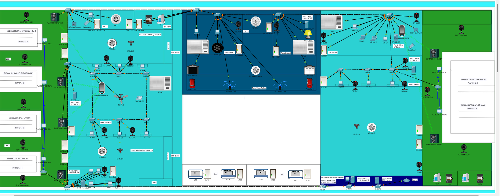

# Chennai Metro Automation

A Cisco Packet Tracer project that automates the Chennai Metro station and includes custom train announcements and websites for each modules in the map with automation.

## Modules Used
<ol>
  <li>Automation IoT Modules</li>
  <li>HTTP SERVER</li>
  <li>DNS SERVER</li>
  <li>DHCP SERVER</li>
  <li>HTML Websites for Police station, Ticket Booking, IoT, Bank</li>
  <li>DHCP SERVER</li>
  <li>IOT SERVER</li>
  <li>Smart Controls</li>
</ol>
And SOOO on.!!

